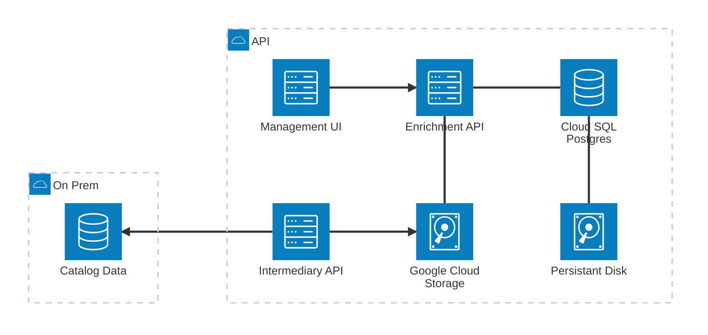
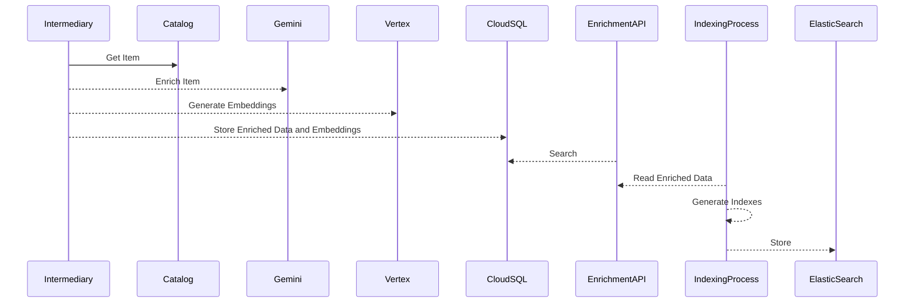
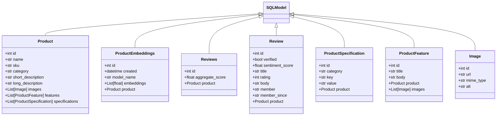
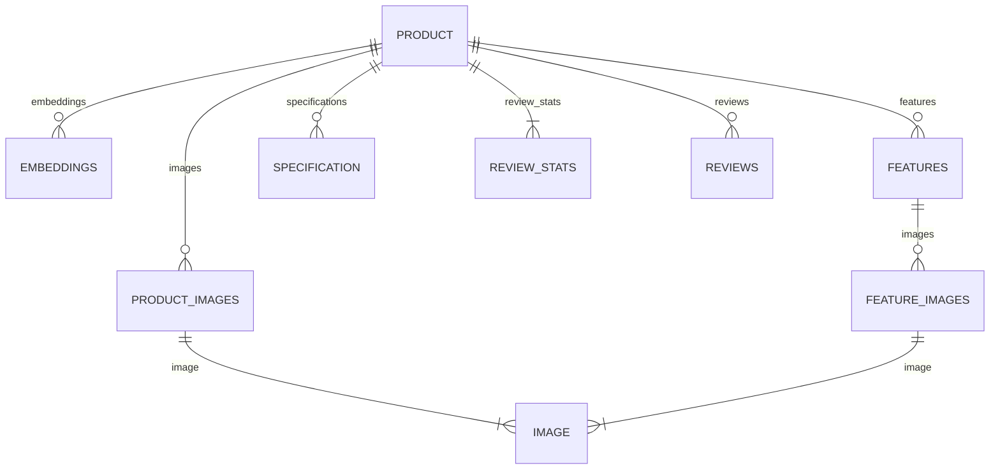

# Product Enrichment

## Introduction

This project introduces an intermediary to be executed prior to
search indexing. The following ideas and code are intended for customer use
and licensed according to open source licensing terms.

## Architecture

> Coming soon

## Workflow

## Runtime Model

## Data Model

